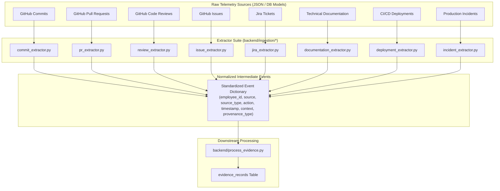

# Engineering Continuity Engine — Ingestion Extractors Documentation

This document provides a comprehensive reference and technical guide for the **Source Extractor Suite** located in [`backend/ingestion/`](file:///Users/rakshak/engineering-comtinuity/backend/ingestion).

---

## 1. Executive Summary & Purpose

The extractor layer is the **first line of processing** in the Engineering Continuity Engine pipeline. Its core responsibility is to translate heterogeneous, source-specific raw engineering telemetry (from GitHub, Jira, documentation repositories, deployment logs, and incident management tools) into a **source-independent, unified intermediate normalized event schema**.



---

## 2. Key Architectural Guarantees

Every extractor in this suite strictly adheres to five core design principles:

1. **Dual Format Compatibility:** Accept raw records as Python `dict` objects (loaded directly from JSON files) OR as SQLAlchemy ORM model instances (e.g. `RawGitHubCommit`, `RawJiraIssue`).
2. **Strict Schema Standardization:** All extractors emit a dictionary containing the exact same top-level required schema keys.
3. **No Loss of Context:** Source-specific details (files changed, line counts, branch, labels, PR status, root cause, severity, environment) are cleanly isolated within a nested `context` dictionary.
4. **Validation & Defensive Execution:** Invalid or malformed raw records (e.g. missing `author_id`, missing `commit_id`, empty `incident_id`) return `None` (or `[]`) without crashing the pipeline.
5. **No Ground Truth Shortcuts:** Extractors NEVER insert downstream calculation concepts like `capability_id`, `score`, or `recency_factor`. They extract facts; inference happens downstream.

---

## 3. Extractor Directory & Modules

| Module Directory | Extractor File | Primary Entrypoint Function | Supported Source Types |
| :--- | :--- | :--- | :--- |
| [`github/`](file:///Users/rakshak/engineering-comtinuity/backend/ingestion/github) | [`commit_extractor.py`](file:///Users/rakshak/engineering-comtinuity/backend/ingestion/github/commit_extractor.py) | `extract_commit_events()` | `"commit"` |
| [`github/`](file:///Users/rakshak/engineering-comtinuity/backend/ingestion/github) | [`pr_extractor.py`](file:///Users/rakshak/engineering-comtinuity/backend/ingestion/github/pr_extractor.py) | `extract_pr_events()` | `"pull_request"` |
| [`github/`](file:///Users/rakshak/engineering-comtinuity/backend/ingestion/github) | [`review_extractor.py`](file:///Users/rakshak/engineering-comtinuity/backend/ingestion/github/review_extractor.py) | `extract_review_events()` | `"review"` |
| [`github/`](file:///Users/rakshak/engineering-comtinuity/backend/ingestion/github) | [`issue_extractor.py`](file:///Users/rakshak/engineering-comtinuity/backend/ingestion/github/issue_extractor.py) | `extract_issue_events()` | `"issue"` |
| [`jira/`](file:///Users/rakshak/engineering-comtinuity/backend/ingestion/jira) | [`jira_extractor.py`](file:///Users/rakshak/engineering-comtinuity/backend/ingestion/jira/jira_extractor.py) | `extract_jira_issue_events()` | `"issue"` |
| [`documentation/`](file:///Users/rakshak/engineering-comtinuity/backend/ingestion/documentation) | [`documentation_extractor.py`](file:///Users/rakshak/engineering-comtinuity/backend/ingestion/documentation/documentation_extractor.py) | `extract_documentation_events()` | `"document"` |
| [`deployments/`](file:///Users/rakshak/engineering-comtinuity/backend/ingestion/deployments) | [`deployment_extractor.py`](file:///Users/rakshak/engineering-comtinuity/backend/ingestion/deployments/deployment_extractor.py) | `extract_deployment_events()` | `"deployment"` |
| [`incidents/`](file:///Users/rakshak/engineering-comtinuity/backend/ingestion/incidents) | [`incident_extractor.py`](file:///Users/rakshak/engineering-comtinuity/backend/ingestion/incidents/incident_extractor.py) | `extract_batch_incident_events()` | `"incident"` |

---

## 4. The Normalized Intermediate Event Schema

Every extractor normalizes raw telemetry into the following standard dictionary layout:

```json
{
  "employee_id": "STRING (Mandatory - ID or handle of the primary actor)",
  "source": "github | jira | documentation | deployments | incidents (Mandatory)",
  "source_type": "commit | pull_request | review | issue | document | deployment | incident (Mandatory)",
  "source_record_id": "STRING (Mandatory - Original record key, e.g. commit hash, PR ID)",
  "action": "STRING (Mandatory - Action descriptor)",
  "timestamp": "ISO-8601 STRING (Mandatory - Date/time string)",
  "provenance_type": "Demonstrated | Proposed | Observed | Review (Mandatory)",
  "context": {
    "title": "STRING (Optional)",
    "description": "STRING (Optional)",
    "files": ["STRING"]
    "...": "Additional source-specific context keys"
  }
}
```

---

## 5. Detailed Extractor Mechanics & Rules

### 5.1. GitHub Commit Extractor ([`commit_extractor.py`](file:///Users/rakshak/engineering-comtinuity/backend/ingestion/github/commit_extractor.py))
* **Function:** `extract_commit_event(raw_commit)` / `extract_commit_events(raw_commits)`
* **Action:** `commit_code`
* **Provenance Type:** `Demonstrated` (Directly authored implementation code)
* **Rules:**
  * Requires valid `author_id` and `commit_id`.
  * Context captures `message`, `files_changed`, `lines_added`, `lines_deleted`, and `branch`.

### 5.2. GitHub Pull Request Extractor ([`pr_extractor.py`](file:///Users/rakshak/engineering-comtinuity/backend/ingestion/github/pr_extractor.py))
* **Function:** `extract_pr_event(raw_pr)` / `extract_pr_events(raw_prs)`
* **Action:** `merge_pull_request` (if merged) / `create_pull_request` (if unmerged)
* **Provenance Type:**
  * `status == "MERGED"` $\rightarrow$ `Demonstrated`
  * `status != "MERGED"` $\rightarrow$ `Proposed` (Proposed code change, not yet merged)
* **Rules:**
  * Requires valid `author_id` and `pr_id`.
  * Context captures `title`, `description`, `status`, `files`, and `target_branch`.

### 5.3. GitHub Review Extractor ([`review_extractor.py`](file:///Users/rakshak/engineering-comtinuity/backend/ingestion/github/review_extractor.py))
* **Function:** `extract_review_event(raw_review)` / `extract_review_events(raw_reviews)`
* **Action:** `review_pull_request`
* **Provenance Type:** `Review` (Evaluation/peer review, not direct implementation)
* **Rules:**
  * Requires valid `reviewer_id` and `review_id`.
  * Context captures `pr_id`, `state` (`APPROVED`, `CHANGES_REQUESTED`), and inline `comments`.

### 5.4. GitHub Issue Extractor ([`issue_extractor.py`](file:///Users/rakshak/engineering-comtinuity/backend/ingestion/github/issue_extractor.py))
* **Function:** `extract_issue_event(raw_issue)` / `extract_issue_events(raw_issues)`
* **Action:** `create_issue`
* **Provenance Type:** `Proposed` (Filing an issue proposes work or reports a bug)
* **Rules:**
  * Requires valid `author_id` and `issue_id`.
  * Context captures `assignee_id`, `title`, `description`, `status`, and `labels`.

### 5.5. Jira Issue Extractor ([`jira_extractor.py`](file:///Users/rakshak/engineering-comtinuity/backend/ingestion/jira/jira_extractor.py))
* **Function:** `extract_jira_issue_event(raw_jira)` / `extract_jira_issue_events(raw_jiras)`
* **Action:** `manage_jira_issue`
* **Provenance Type:** `Proposed`
* **Rules:**
  * Employee ID selected from `assignee_id` first; falls back to `reporter_id` if unassigned.
  * Context captures `reporter_id`, `assignee_id`, `updated_at`, `issue_type`, `summary`, `description`, `status`, and `components`.

### 5.6. Documentation Extractor ([`documentation_extractor.py`](file:///Users/rakshak/engineering-comtinuity/backend/ingestion/documentation/documentation_extractor.py))
* **Function:** `extract_documentation_event(raw_doc)` / `extract_documentation_events(raw_docs)`
* **Action:** `author_documentation`
* **Provenance Type:** `Demonstrated` (Authoring documentation demonstrates domain knowledge)
* **Rules:**
  * Requires `author_id` and `doc_id`.
  * Prefers `updated_at` timestamp over `created_at`.
  * Context captures `title`, `content_summary`, `doc_type`, `service`, `filepath`, and `last_modified_by`.

### 5.7. Deployment Extractor ([`deployment_extractor.py`](file:///Users/rakshak/engineering-comtinuity/backend/ingestion/deployments/deployment_extractor.py))
* **Function:** `extract_deployment_event(raw_deployment)` / `extract_deployment_events(raw_deployments)`
* **Action:** `rollback_service` (if action == ROLLBACK) / `deploy_service` (if action == DEPLOY)
* **Provenance Type:** `Demonstrated` (Executing production deployments demonstrates operational capability)
* **Rules:**
  * Requires `deployed_by` and `deployment_id`.
  * Context captures `service`, `environment`, `action`, `commit_hash`, `status`, and `notes`.

### 5.8. Incident Extractor ([`incident_extractor.py`](file:///Users/rakshak/engineering-comtinuity/backend/ingestion/incidents/incident_extractor.py))
* **Function:** `extract_incident_events(raw_incident)` / `extract_batch_incident_events(raw_incidents)`
* **Multi-Event Generation:** A single raw incident produces **multiple** normalized events (one per participant/role).
* **Role Mappings:**
  1. **Lead Responder:** `action: "lead_incident_response"`, `provenance_type: "Demonstrated"`
  2. **Participants:** `action: "participate_incident_response"`, `provenance_type: "Demonstrated"`
  3. **Reporter:** `action: "report_incident"`, `provenance_type: "Observed"` (if reporter was not lead or participant)
* **Rules:**
  * Ensures no duplicate events for the same employee within one incident.
  * Context captures `role`, `title`, `severity`, `service`, `summary`, `root_cause`, `action_items`, and `resolved_at`.

---

## 6. Summary Matrix: Actions & Provenance Types

| Source Type | Extractor Action | Provenance Type | Provenance Rationale |
| :--- | :--- | :--- | :--- |
| **Commit** | `commit_code` | `Demonstrated` | Direct code contribution |
| **Pull Request (Merged)** | `merge_pull_request` | `Demonstrated` | Merged feature/bugfix code |
| **Pull Request (Unmerged)**| `create_pull_request` | `Proposed` | Proposed pull request |
| **Code Review** | `review_pull_request` | `Review` | Peer code review & feedback |
| **GitHub Issue** | `create_issue` | `Proposed` | Filed issue / feature request |
| **Jira Issue** | `manage_jira_issue` | `Proposed` | Ticket management / work assignment |
| **Documentation** | `author_documentation` | `Demonstrated` | Technical writing / architecture docs |
| **Deployment (Deploy)** | `deploy_service` | `Demonstrated` | Production/staging service rollout |
| **Deployment (Rollback)**| `rollback_service` | `Demonstrated` | Emergency deployment rollback |
| **Incident Lead** | `lead_incident_response` | `Demonstrated` | Primary incident lead troubleshooting |
| **Incident Participant** | `participate_incident_response` | `Demonstrated` | Active incident bridge responder |
| **Incident Reporter** | `report_incident` | `Observed` | Reported production incident |

---

## 7. Programmatic Usage Examples

### Single Item Extraction Example
```python
from backend.ingestion.github.commit_extractor import extract_commit_event

raw_commit_json = {
    "commit_id": "c001a1",
    "author_id": "E001",
    "timestamp": "2026-05-02T09:15:00Z",
    "message": "feat(api): add v2 payment intent routing endpoint",
    "files_changed": ["services/api/router.go", "services/api/intent_handler.go"],
    "lines_added": 120,
    "lines_deleted": 15,
    "branch": "main"
}

event = extract_commit_event(raw_commit_json)
print(event["action"])          # "commit_code"
print(event["provenance_type"]) # "Demonstrated"
print(event["context"]["files"])# ["services/api/router.go", ...]
```

### Batch Extraction Example (Pipeline Integration)
```python
from backend.ingestion.incidents.incident_extractor import extract_batch_incident_events

raw_incidents = [
    {
        "incident_id": "INC-101",
        "reporter_id": "E001",
        "lead_responder_id": "E003",
        "participants": ["E004", "E006"],
        "timestamp": "2026-06-15T03:30:00Z",
        "title": "Payment gateway latency spike",
        "severity": "SEV-1",
        "service": "payment-service"
    }
]

# Produces 3 events: 1 for lead (E003), 2 for participants (E004, E006), 1 for reporter (E001)
events = extract_batch_incident_events(raw_incidents)
print(f"Generated {len(events)} normalized events from 1 raw incident.")
```

---

## 8. Test Suite Verification

Every extractor is thoroughly verified by automated unit tests in the [`tests/`](file:///Users/rakshak/engineering-comtinuity/tests) directory:

```bash
# Run pytest on all extractor test modules
pytest tests/test_*_extractor.py
```

* [`test_commit_extractor.py`](file:///Users/rakshak/engineering-comtinuity/tests/test_commit_extractor.py)
* [`test_pr_extractor.py`](file:///Users/rakshak/engineering-comtinuity/tests/test_pr_extractor.py)
* [`test_review_extractor.py`](file:///Users/rakshak/engineering-comtinuity/tests/test_review_extractor.py)
* [`test_issue_extractor.py`](file:///Users/rakshak/engineering-comtinuity/tests/test_issue_extractor.py)
* [`test_jira_extractor.py`](file:///Users/rakshak/engineering-comtinuity/tests/test_jira_extractor.py)
* [`test_documentation_extractor.py`](file:///Users/rakshak/engineering-comtinuity/tests/test_documentation_extractor.py)
* [`test_deployment_extractor.py`](file:///Users/rakshak/engineering-comtinuity/tests/test_deployment_extractor.py)
* [`test_incident_extractor.py`](file:///Users/rakshak/engineering-comtinuity/tests/test_incident_extractor.py)
