# Database Layer Documentation (`engineering_continuity`)

This document describes the PostgreSQL 18 database architecture, configuration, migration management, seeding process, reset instructions, and automated test execution.

---

## 1. Database Architecture & Schema

The database consists of **12 PostgreSQL tables** split into two categories: Core Configuration Tables and Raw Telemetry Source Tables.

```mermaid
erDiagram
    employees {
        string id PK
        string name
        string role
    }
    services {
        string id PK
        string name
        string description
    }
    modules {
        string id PK
        string service_id FK
        string name
        string description
    }
    capabilities {
        string id PK
        string name
        string description
    }
    raw_github_commits {
        int id PK
        string commit_id UK
        string author_id
        datetime timestamp
        text message
        json files_changed
        int lines_added
        int lines_deleted
        string branch
    }
    raw_github_pull_requests {
        int id PK
        string pr_id UK
        string author_id
        datetime timestamp
        string title
        text description
        string status
        json files
        string target_branch
    }
    raw_github_reviews {
        int id PK
        string review_id UK
        string pr_id
        string reviewer_id
        datetime timestamp
        string state
        json comments
    }
    raw_github_issues {
        int id PK
        string issue_id UK
        string author_id
        string assignee_id
        datetime timestamp
        string title
        text description
        string status
        json labels
    }
    raw_jira_issues {
        int id PK
        string jira_id UK
        string reporter_id
        string assignee_id
        datetime timestamp
        datetime updated_at
        string issue_type
        string summary
        text description
        string status
        json components
    }
    raw_incidents {
        int id PK
        string incident_id UK
        string reporter_id
        string lead_responder_id
        json participants
        datetime timestamp
        datetime resolved_at
        string title
        string severity
        string service
        text summary
        text root_cause
        json action_items
    }
    raw_deployments {
        int id PK
        string deployment_id UK
        string deployed_by
        datetime timestamp
        string environment
        string service
        string action
        string commit_hash
        string status
        text notes
    }
    raw_documents {
        int id PK
        string doc_id UK
        string author_id
        string last_modified_by
        datetime created_at
        datetime updated_at
        string doc_type
        string title
        string service
        text content_summary
        string filepath
    }

    services ||--o{ modules : contains
```



---

## 2. PostgreSQL Connection Configuration

Connections are configured via environment variables.

1. **Environment Template (`.env.example`)**:
   Copy `.env.example` to `.env`:
   ```bash
   cp .env.example .env
   ```

2. **Environment File (`.env`)**:
   Set your local PostgreSQL password:
   ```env
   POSTGRES_USER=postgres
   POSTGRES_PASSWORD=your_actual_pgadmin_password
   POSTGRES_HOST=localhost
   POSTGRES_PORT=5432
   POSTGRES_DB=engineering_continuity
   ```

> [!IMPORTANT]
> Never commit `.env` containing credentials to Git. `.env` is listed in `.gitignore`.

---

## 3. Database Migrations (Alembic)

Migrations manage table creation and schema updates.

- **Run all pending migrations**:
  ```bash
  ./.venv/bin/alembic upgrade head
  ```

- **Roll back the last migration**:
  ```bash
  ./.venv/bin/alembic downgrade -1
  ```

- **Generate a new migration revision**:
  ```bash
  ./.venv/bin/alembic revision --autogenerate -m "description_of_changes"
  ```

---

## 4. Seeding the Database

Populate PostgreSQL tables from existing JSON configuration and raw telemetry datasets (`data/config/` and `data/raw/`):

```bash
./.venv/bin/python3 -m backend.seed
```

**Seeded Record Counts**:
- `employees`: 5 records
- `capabilities`: 5 records
- `raw_github_commits`: 35 records
- `raw_github_pull_requests`: 12 records
- `raw_github_reviews`: 16 records
- `raw_github_issues`: 12 records
- `raw_jira_issues`: 16 records
- `raw_incidents`: 9 records
- `raw_deployments`: 9 records
- `raw_documents`: 6 records
- **Total**: 115 raw records + 10 config records.

---

## 5. Resetting the Database

To drop all tables and re-apply migrations and seed data:

```bash
./.venv/bin/python3 -c "from backend.database import drop_db; drop_db()"
./.venv/bin/alembic upgrade head
./.venv/bin/python3 -m backend.seed
```

---

## 6. Running Automated Tests

Run the test suite to verify database connection, schema migration, seed loading, and record count matching:

```bash
./.venv/bin/pytest tests/test_database.py -v
```
